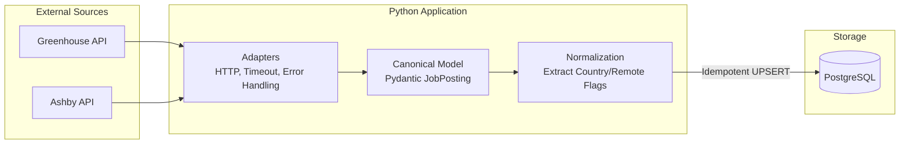

# Data Career Radar

> An automated ETL pipeline to surface truly eligible remote data roles for LATAM professionals.

## 🔴 The Problem
Job boards are fundamentally broken for international remote workers. Filtering by "Remote" often yields thousands of jobs that are actually restricted to "Remote - US Only", "Remote - UK", or require specific state residencies. Identifying a truly eligible opportunity (e.g., "Remote - Brazil", "Remote - LATAM", or "Anywhere") requires opening each posting, reading the fine print, and wasting hours of manual labor.

## 🟢 The Solution
**Data Career Radar** bypasses job aggregators entirely. It connects directly to the underlying applicant tracking systems (Greenhouse, Ashby, etc.) of targeted tech companies, ingests the raw data, and normalizes the chaotic location strings into deterministic `country_code` and `is_remote` flags. 

The result? A highly curated, queryable database of opportunities that strictly match my eligibility criteria, turning hours of manual searching into an automated, high-ROI workflow.

## 🏗️ Architecture & Tech Stack
The project is built around a robust, scalable ETL architecture tailored for resilience and data integrity.

* **Language:** Python 3.10+
* **Ingestion:** Requests, Pydantic (Strict typing and data validation)
* **Storage:** PostgreSQL 15, SQLAlchemy 2.0 (ORM)
* **Migrations:** Alembic
* **Quality & CI:** Pytest (Unit & Integration), Flake8, Docker Compose



## 🧠 Key Engineering Decisions

1. **The Adapter Pattern:** 
   Each API has its own chaotic payload structure. Adapters isolate this external messiness, mapping specific API fields (e.g., Ashby's `jobTitle` vs Greenhouse's `title`) into a single, unified `JobPosting` Pydantic model. Adding a new provider requires zero changes to the storage or normalization logic.
2. **Idempotency & UPSERTs:** 
   The pipeline is designed to run multiple times a day without creating duplicate records. The persistence layer utilizes a `UNIQUE(source, board_slug, external_id)` constraint paired with PostgreSQL `ON CONFLICT DO UPDATE`. It elegantly inserts new roles and only updates the `last_seen_at` timestamp for existing ones.
3. **Deterministic Normalization:** 
   Instead of guessing eligibility purely with LLMs, a deterministic Regex/Logic layer extracts explicit signals (like `country_code='BR'` or `is_remote=True`) from raw strings like `"São Paulo / SP / Brazil"`, guaranteeing predictable downstream analytics.

## 🚀 Local Setup

1. **Start the database:**
   ```bash
   cp .env.example .env
   docker-compose up -d
   ```
2. **Install the package and dependencies:**
   ```bash
   pip install -e ".[dev]"
   ```
3. **Run database migrations:**
   ```bash
   alembic upgrade head
   ```
4. **Run the Ingestion CLI:**
   ```bash
   # Ingest a specific company board
   career-radar --action ingest --source greenhouse --slug clara
   ```
5. **Run tests:**
   ```bash
   pytest
   ```
